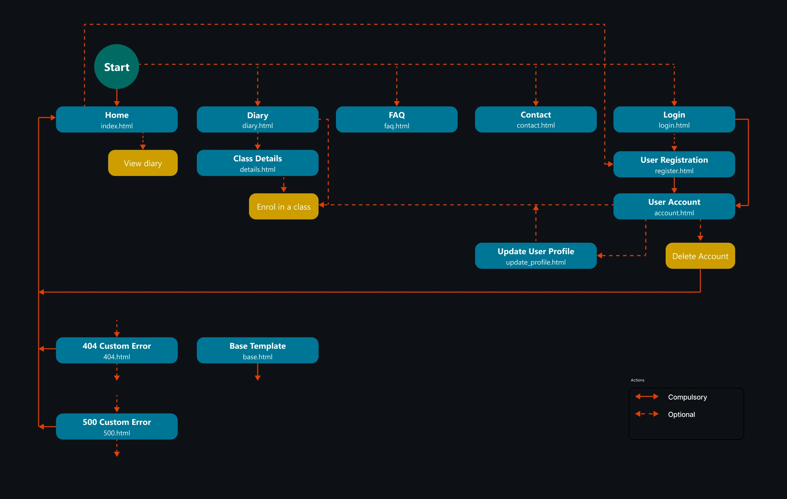

# THIS IS A DRAFT DOCUMENT, AND NOT YET FINALISED #

# Craftr

## Overview

Craftr is an annual online (fictional) event dedicated to digital crafting, bringing together creative minds from around the world to explore the latest innovations in craft technology. Held over three days every April, this year's event will take place from 21 to 23 April 2025.

Digital crafting is the dynamic fusion of technology and creativity, enabling individuals to design and create unique projects with precision and innovation. This evolving craft field spans a variety of disciplines, including:

- **Paper and Card Crafts**: ranging from scrapbooking to personalised greeting cards.

- **Vinyl and Decal Crafts**: stickers, signage, decals, and vinyl applications.

- **Graphic Design Applications**: custom artwork for t-shirts, drinkware, and other items.

- **Fabric Crafts**: intricate embroidery, textile design, and fabric embellishments.

- **3D Modelling**: digital sculpting that brings ideas to life.

- **Laser Cutting**: create, cut, and embellish unique designs for any item including jewellery, signage, and other items.

To achieve professional results, many digital crafters utilise cutting machines such as [Cricut](https://cricut.com/en-gb/) or [Silhouette](https://www.silhouetteamerica.com/), or even laser cutters like [Glowforge](https://glowforge.com/), to create intricate and precise designs that can be applied to a variety of materials.

This website serves as the central hub for Craftr, providing information about the event, allowing participants to create accounts, browse, and register for available classes. Whether a beginner looking to experiment with digital crafting or an expert seeking new techniques, Craftr is the perfect platform for anyone to connect, learn, and create.

### Site Preview

### Site Link

[live site]: https://craftr-bfd2923e1ca4.herokuapp.com/
The [live site] is hosted by Heroku.

### GitHub Repository
[here]: https://github.com/dvfrancis/craftr
Click [here] to access the GitHub repository.

## Index

1. [Overview](#overview)
    1. [Site Preview](#site-preview)
    2. [Site Link](#site-link)
    3. [GitHub Repository](#github-repository)
2. [User Experience Design](#user-experience-design)
    1. [Strategy](#strategy)
        1. [Key Business Goals](#key-business-goals)
        2. [Key User Goals](#key-user-goals)
        3. [User Experience](#user-experience)
        4. [User Expectations](#user-expectations)
        5. [User Stories](#user-stories)
        6. [User Personas](#user-personas)
    2. [Scope](#scope)
        1. [Existing Features](#existing-features)
        2. [Future Features](#future-features)
    3. [Structure](#structure)
        1. [User Flow Diagram](#user-flow-diagram)
        2. [Logic Flowchart](#logic-flowchart)
    4. [Skeleton](#skeleton)
        1. [Wireframes](#wireframes)
            1. [Mobile](#mobile)
            2. [Tablet](#tablet)
            3. [Desktop](#desktop)
    5. [Surface](#surface)
        1. [Colours](#colours)
        2. [Typography](#typography)
        3. [Media](#media)
        4. [Content](#content)
3. [Testing](#testing)
4. [Technologies Used](#technologies-used)
5. [Deployment](#deployment)
    1. [GitHub Pages](#github-pages)
    2. [Forks](#forks)
    3. [Local Clones](#local-clones)
    4. [Automatically Create a Gitpod Workspaces](#automatically-create-a-gitpod-workspace)
6. [Credits and References](#credits-and-references)

7. [Acknowledgements](#acknowledgements)

## User Experience Design

### Strategy

#### Key Business Goals

- Attract crafters of all levels to participate, learn something new, and share their positive experiences of the event.
- The organisers of the event will see value from increased numbers of people visiting the website, the positive word-of-mouth generated, and more sign-ups to their mailing list.
- The home page will engage visitors' interests, while encouraging them to sign up for one or more of the classes being run across the event.

#### Key User Goals

- The potential to learn a new craft, or something new about a craft with which they are familiar.
- Enjoy a positive and useful experience without having to spend any money.
- Link up with like-minded people through social media, to share their thoughts on the event.

#### User Experience

- Target audience:
    - Anyone 13 or older who enjoys using technology and being creative. 
    - Teenager, student, employed, or retired.
    - Has an interest in arts and crafts.
    - Those with an interest in the potential of taking a hobby and turning it into a source of income.
    - Someone looking for a productive but relaxing way to spend their free time.
 
#### User Expectations

- The website:
    - is intuitive, accessible, responsive, and easy to navigate.
    - has a design that visitors will immediately understand, and be able to use; for example, HTML elements behave in the way most people would expect.
    - contains useful information that will prompt a visitor to sign up for classes.
    - is designed to appeal to those who are creative, and possibly enjoy crafting, and help them feel comfortable and welcome.
    - allows a user to register their details so that they can bookmark or register for interesting classes.

#### User Stories

##### First time visitor goals
    
- "What is Craftr about?”
- “What training is being given?”
- "When do the classes happen?"
- “How do I sign up?”
        
##### Returning visitor goals
    
- “What other classes am I interested in attending?”
- "When is my class due to start?"
- "Where can I keep track of the classes I've signed up for?"
    
##### Frequent visitor goals
    
- “Who running my class?”
- "How do I cancel my class enrolment?"
- "How can I contact the organisers of this event?"

#### User Personas

The website is designed to appeal to all demographics, but the following personas are meant to represent a range of potential users:

- User 1: Female aged 20-50, enthusiast who wants to develop her crafting skills, loves creating things, unsure where to start.
- User 2: Male aged 18-35, looking for a way to relax, enjoys new hobbies, limited knowledge about the subject.
- User 3: Female aged 25-45, looking for free training, enjoys connecting with others, hasn't been able to find many beginner-friendly workshops.

##### User 1

“I really enjoy crafting but I'm not sure how to improve my abilities.”

###### Acceptance Criteria

- Ensure users of all skill levels (beginner to advanced) find suitable classes ([see issue #55](https://github.com/dvfrancis/craftr/issues/55)) .
- Provide an intuitive way to navigate the site and discover content ([see issue #56](https://github.com/dvfrancis/craftr/issues/56)).
- Enable users to create accounts and track enrolments ([see issue #59](https://github.com/dvfrancis/craftr/issues/59)).
    
###### Tasks

- Label each class with its appropriate skill level.
- Design an intuitive navigation menu for easy browsing.
- Develop a user-friendly account creation and class tracking system.
    
##### User 2

“I came across this website by accident, it looks really interesting. Where do I start?”

###### Acceptance Criteria

- Make diverse craft types visible and engaging on the homepage ([see issue #57](https://github.com/dvfrancis/craftr/issues/57)).
- Ensure information is easily accessible for first-time visitors ([see issue #58](https://github.com/dvfrancis/craftr/issues/58)).
- Create an inviting and user-friendly interface ([see issue #57](https://github.com/dvfrancis/craftr/issues/57)).
    
###### Tasks

- Design an engaging homepage that showcases various craft types.
- Ensure class details are prominently displayed and easy to locate.
- Develop a clean and welcoming website layout.

##### User 3

“I'm seeking accessible training courses that I can attend with confidence.”

###### Acceptance Criteria

- Ensure class information is detailed and easily accessible ([see issue #60](https://github.com/dvfrancis/craftr/issues/60)).
- Clearly outline instructor details and course descriptions ([see issue #60](https://github.com/dvfrancis/craftr/issues/60)).
- Make sharing information simple and effective ([see issue #54](https://github.com/dvfrancis/craftr/issues/54)).
    
###### Tasks

- Maintain a well-organized and searchable class directory.
- Provide comprehensive course descriptions, including instructor details.
- Implement easy-to-use social media sharing features.

### Scope

#### Existing Features

#### Future Features

### Structure

#### User Flow Diagram

Click to view the user flow diagram

User routes through the site have been plotted as a user flow diagram; pathways can be compulsory or optional, which is shown on the diagram.

#### Database Architecture

Click to view the entity relationship diagram (ERD)

PostgreSQL was used to store the database for the site, and the ERD was created using [Figma](https://www.figma.com/).

#### Data Models

1. **User**

Django's User model was used for the creation of user accounts (and is extended by UserProfile).

|Description|Key Type|Name|Field Type|Validation|
| ------------- | ------------- | ------------- | ------------- | ------------- |
|Username|Key|`username`|CharField|*Django ensures `username` is unique and limited to 150 characters*
|Password|Key|`password`|CharField|*Django provides built-in validation for `password`, which can be customised via settings.py*
|First Name|Key|`first_name`|CharField|*Django ensures `first_name` is limited to 150 characters*
|Last Name|Key|`last_name`|CharField|*Django ensures `last_name` is limited to 150 characters*
|Email address|Key|`email`|EmailField|*Django provides built-in validation for `email`*

2. **UserProfile**

Custom model that extends Django's User model by adding site-specific fields.

|Description|Key|Name|Field Type|Validation|
| ------------- | ------------- | ------------- | ------------- | ------------- |
|Username|Foreign|`username`|CharField|*Linked to the `User` model, in a 1-2-1 relationship*
|Location|Key|`location`|CharField|`max_length=100`. Field required through validation by `def clean(self)`
|Experience Level|Key|`experience`|ChoiceField|`choices=EXPERIENCE_CHOICES, default=BEGINNER, max_length=12`. Field required through validation by `def clean(self)`
|User Photograph|Key|`photograph`|CloudinaryField|`default='placeholder', blank=True, null=True`

3. **EventDay**

Custom model that stores the days on which the event runs. `Class Meta` options ensure the day title is unique regardless of case sensitivity.

|Description|Key|Name|Field Type|Validation|
| ------------- | ------------- | ------------- | ------------- | ------------- |
|Unique Field|Primary|`id`|AutoField|`primary_key=true` (I had a minor problem with the existing primary key field so added this as a solution)
|Date|Foreign|`day_date`|DateField|*Linked to the `EventClass` model, in a one-to-many relationship*. Field required through validation by `def clean(self)`
|Title|Key|`day_title`|CharField|`max_length=100, unique=True`. Field required through validation by `def clean(self)`
|Description|Key|`day_description`|TextField|

4. **EventClass**

Custom model that lists the classes that run across the entire event. `Class Meta` options ensure that multiple classes cannot be scheduled at the same time.

|Description|Key|Name|Field Type|Validation|
| ------------- | ------------- | ------------- | ------------- | ------------- |
|Date|Foreign|`event_day`|DateField|*Linked to the `EventDay` model, in a many-to-one relationship*
|Start Time|Key|`start_time`|TimeField|`start_time` cannot be later than `end_time` as validated by `def clean(self)`
|End Time|Key|`end_time`|TimeField|
|Title|Key|`class_title`|CharField|`max_length=100`
|Description|Key|`class_description`|TextField|
|Difficulty|Key|`difficulty`|ChoiceField|`choices=DIFFICULTY_CHOICES, default=BEGINNER, max_length=12`
|Image|Key|`class_image`|CloudinaryField|`default='class_placeholder', blank=True, null=True`
|Instructor|Key|`instructor`|CharField|`max_length=100`
|Instructor Photo|Key|`instructor_photo`|CloudinaryField|`default='instructor_placeholder', blank=True, null=True`
|Instructor Biography|Key|`instructor_bio`|TextField|

5. **Enrolment**

Custom model that tracks which classes different users are enrolled upon. `Class Meta` options ensure users cannot enrol on the same class multiple times.

|Description|Key|Name|Field Type|Validation|
| ------------- | ------------- | ------------- | ------------- | ------------- |
|Username|Foreign|`username`|CharField|*Linked to the `User` model, in a many-to-one relationship* `on_delete=models.CASCADE, related_name="enrol_status"`
|Class Title|Foreign|`class_title`|TextField|*Linked to the `EventClass` model, in a many-to-one relationship* `on_delete=models.CASCADE, related_name="enrolments"`

6. **Contact**

Custom model that stores any messages sent through the contact form, for later reference.

|Description|Key|Name|Field Type|Validation|
| ------------- | ------------- | ------------- | ------------- | ------------- |
|First Name|Key|`first_name`|CharField|`max_length=100`
|Last Name|Key|`last_name`|CharField|`max_length=100`
|Email|Key|`email`|EmailField|*Django provides built-in validation for `email`*
|Message|Key|`message`|TextField|
|Creation Date/Time|Key|`created_at`|DateTimeField|`auto_now_add=True`

### Skeleton

#### Wireframes

Wireframe diagrams of my initial ideas:

##### Mobile

###### Home

Click to view the mobile home page wireframe

###### Game

Click to view the mobile game page wireframe

###### FAQ

Click to view the mobile FAQ page wireframe

###### 404

Click to view the mobile custom error page wireframe

##### Tablet

###### Home

Click to view the tablet home page wireframe

###### Game

Click to view the tablet game page wireframe

###### FAQ

Click to view the tablet FAQ page wireframe

###### 404

Click to view the tablet custom error page wireframe

##### Desktop

###### Home

Click to view the desktop home page wireframe

###### Game

Click to view the desktop game page wireframe

###### FAQ

Click to view the desktop FAQ page wireframe

###### 404

Click to view the desktop custom error page wireframe

### Surface

#### Colours

Click to view the chosen colour scheme

- Website colours taken from the Sarah Renae Clarke Colour Catalogue (Volume 2), card 390.
- Text colours are split between black (#000) and white (#FFF).

#### Typography

Google Fonts was used to source all fonts:
  
- [Libre Franklin](https://fonts.google.com/specimen/Libre+Franklin)
- [Josefin Slab](https://fonts.google.com/specimen/Josefin+Slab)
- [Junge](hhttps://fonts.google.com/specimen/Junge)

#### Media

The following image was taken from [Deposit Photos](https://depositphotos.com/), and used on the 404.html page:
- [Devastated gambler man...](https://depositphotos.com/photo/devastated-gambler-man-losing-lot-money-playing-poker-casino-gambling-439339268.html)

#### Content

All website copy has been written by myself.

## Testing

- Please refer to [TESTING.md](TESTING.md) for details.

## Technologies Used

- [HTML](https://en.wikipedia.org/wiki/HTML), [CSS](https://en.wikipedia.org/wiki/CSS), and [JavaScript.](https://en.wikipedia.org/wiki/JavaScript) - for website structure / interactivity.
- [Bootstrap](https://en.wikipedia.org/wiki/Bootstrap_(front-end_framework)) - for layout / some styling.
- [Google Chrome Developer Tools](https://developer.chrome.com/docs/devtools/) - for troubleshooting / testing (including for [Lighthouse](https://developer.chrome.com/docs/lighthouse/overview/) performance reports).
- [Deck of Cards - An API](https://www.deckofcardsapi.com/) - for obtaining the deck of cards.
- [GitHub](https://github.com/) - for version control.
- [GitHub Pages](https://pages.github.com/) - for website hosting.
- [Gitpod](https://gitpod.io/) - for online coding.
- [Visual Studio Code](https://code.visualstudio.com/) - for local coding.
- [Figma](https://www.figma.com/) - for flow diagram / flowchart / wireframe design.
- [Microsoft CoPilot](https://copilot.microsoft.com/) - for general coding advice.
- [Google Fonts](https://fonts.google.com/) - for all fonts.
- [FontAwesome](https://fontawesome.com/) - for all icons.
- [Markdown](https://en.wikipedia.org/wiki/Markdown) - for formatting all documentation.
- [Google Chrome](https://www.google.co.uk/chrome/) - for website preview / testing.
- [Microsoft Edge](https://www.microsoft.com/en-gb/edge/) - for website preview / testing.
- [Firefox](https://www.mozilla.org/en-GB/firefox/new/) - for website preview / testing.
- [Opera](https://www.opera.com/) - for website preview / testing.
- [Safari](https://www.apple.com/uk/safari/) - for website preview / testing and mobile screenshots (using an iPad Pro (12.9-inch) (2nd generation)).
- [W3C HTML Checker](https://validator.w3.org/) - for checking HTML code.
- [W3C CSS Checker](https://jigsaw.w3.org/css-validator/) - for checking CSS code.
- [JSHint](https://jshint.com/) - for checking JavaScript code.
- [Web Accessibility Evaluation Tool (WAVE)](https://wave.webaim.org/) - for checking website accessibility.
- [Responsive Web Design Checker](https://responsivedesignchecker.com/) - for checking website responsiveness.
- [CSS Tools: Reset CSS](https://meyerweb.com/eric/tools/css/reset/) - for addressing browser inconsistencies.
- [Website Mockup Generator](https://websitemockupgenerator.com/) - for a preview of the site on different devices.
- [GoFullPage](https://gofullpage.com/) - for exporting full-size web page previews (this does not include Firefox, which does not support it).
- [Deposit Photos](https://depositphotos.com/) - for the [Devastated gambler man...](https://depositphotos.com/photo/devastated-gambler-man-losing-lot-money-playing-poker-casino-gambling-439339268.html) image used on the 404.html page.
- [Sarah Renae Clarke's Colour Catalogue V2](https://sarahrenaeclark.com/color-palettes/) - for website colours.
- [Font Joy](https://fontjoy.com/) - for font pairing inspiration.
- [Microsoft Photos](https://apps.microsoft.com/detail/9wzdncrfjbh4?hl=en-gb&gl=US) - for image editing.
- [Affinity Photo 2](https://affinity.serif.com/en-gb/photo/) - for image editing.
- [To WebP](https://towebp.io/) - for converting all images to webp format.
- [Favicon Generator](https://favicon.io/favicon-converter/) - for generating the website favicon.
- [Diffchecker](https://www.diffchecker.com/) - for comparing JavaScript code.

## Deployment

### GitHub Pages

The site was deployed using GitHub Pages, as follows:

- Open the repository > 'Settings'.
- On the left, under 'Code and automation', click 'Pages'.
- On the right section, under 'Build and deployment' and 'Source', click to select 'Deploy from a branch'.
- Under 'Branch', click to select the main branch.
- Click 'Save'.

### Forks

To make changes to a repository, without affecting the original copy, you can fork (duplicate) it:

- Open the repository.
- To the right of the page, click the 'Fork' button.
- You can then open this repository in the IDE of your choice, and make your own changes.

### Local Clones

To deploy the project on your own computer you can clone it:

- Open the repository, and click the '<> Code' button.
- On 'Local', select your preferred cloning method, and copy the link.
- Open a prompt in your chosen IDE.
- Navigate to the destination directory, and then enter `git clone`, paste the copied string, and hit 'Enter'.

### Automatically Create a Gitpod Workspace

You can create a Gitpod workspace for this repository by clicking the following button (it requires the [Gitpod browser extension](https://www.gitpod.io/docs/configure/user-settings/browser-extension)).

## Credits and References

- [Duckett, J. (2011) HTML & CSS Design and Build Websites](https://htmlandcssbook.com/) - Indianapolis: John Wiley & Sons, Inc.
- [Duckett, J. (2014) JavaScript and jQuery Interactive Front-End Web Development](https://javascriptbook.com/) - Indianapolis: John Wiley & Sons, Inc.
- [How to create a copyright symbol](https://blog.hubspot.com/website/html-code-copyright) - for the footer copyright symbol.
- [Displaying the current year](https://sysadminsage.com/javascript-get-current-year/) - for displaying the current copyright year in the footer.
- [Generate a random boolean value](https://stackoverflow.com/questions/36756331/js-generate-random-boolean) - for assigning aces high or low.
- [How to set a favicon in GitHub Pages](https://stackoverflow.com/questions/35037482/favicon-with-github-pages) - for setting a GitGub Pages favicon.
- [Modal](https://getbootstrap.com/docs/5.0/components/modal/) - for generating a Bootstrap modal.
- [Bootstrap 5 Modal](https://www.w3schools.com/bootstrap5/bootstrap_modal.php) - for Bootstrap pop-up modal dialogs.
- [Element: insertAdjacentHTML() method](https://developer.mozilla.org/en-US/docs/Web/API/Element/insertAdjacentHTML) - for adding modal dialogs to pages.
- [HTML DOM Element remove()](https://www.w3schools.com/jsref/met_element_remove.asp) - for removing modal dialogs from pages.
- [try...catch](https://developer.mozilla.org/en-US/docs/Web/JavaScript/Reference/Statements/try...catch) - for testing calls to the API.
- [Julia Konovalova's example of Try / Catch.](https://github.com/IuliiaKonovalova/flash_cards/blob/main/assets/js/grammar_quiz.js)
- [localStorage in JavaScript: A complete guide.](https://blog.logrocket.com/localstorage-javascript-complete-guide/)
- [Extracting numbers from localStorage as numbers](https://stackoverflow.com/questions/40005108/extracting-numbers-from-localstorage-as-numbers) - how to convert localStorage values into numbers.

## Acknowledgements

- Extra special thanks to Andrew Parton, for his coding advice and support.
- Thanks to my mentor, Juliia Konovalova, for her coding advice.