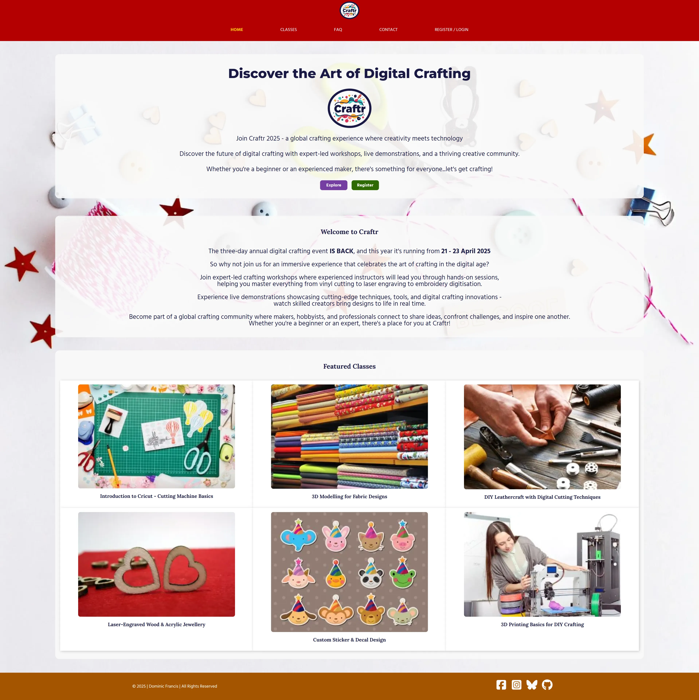

# THIS IS A DRAFT DOCUMENT, AND NOT YET FINALISED #

[Return to the Craftr README.md](https://github.com/dvfrancis/craftr/blob/main/README.md)

# Testing

## Index

1. [Code Validation](#code-validation)
    1. [HTML](#html)
    2. [CSS](#css)
    3. [JavaScript](#javascript)
    4. [Python](#python)
2. [Manual Validation](#manual-validation)
    1. [index.html](#indexhtml)
    2. [diary.html](#diaryhtml)
    3. [details.html](#detailshtml)
    4. [faq.html](#faqhtml)
    5. [contact.html](#contacthtml)
    6. [register.html](#registerhtml)
    7. [login.html](#loginhtml)
    8. [account.html](#accounthtml)
    9. [update_profile.html](#update_profilehtml)
    10. [404.html](#404html)
    11. [500.html](#500html)
3. [User Story Validation](#user-story-validation)
    1. [First Time Visitor Goals](#first-time-visitor-goals)
    2. [Returning Visitor Goals](#returning-visitor-goals)
    3. [Frequent Visitor Goals](#frequent-visitor-goals)
4. [User Personas](#user-personas)
    1. [User 1](#user-1)
    2. [User 2](#user-2)
    3. [User 3](#user-3)
5. [Browser Compatibility](#browser-compatibility)
    1. [Google Chrome](#google-chrome)
    2. [Microsoft Edge](#microsoft-edge)
    3. [Firefox](#firefox)
    4. [Opera](#opera)
    5. [Safari](#safari-on-an-ipad)
6. [Accessibility](#accessibility)
    1. [index.html]()
    2. [diary.html]()
    3. [details.html]()
    4. [faq.html]()
    5. [contact.html]()
    6. [register.html]()
    7. [login.html]()
    8. [account.html]()
    9. [update_profile.html]()
    10. [404.html]()
    11. [500.html]()
7. [Responsiveness](#responsiveness)
    1. [index.html]()
    2. [diary.html]()
    3. [details.html]()
    4. [faq.html]()
    5. [contact.html]()
    6. [register.html]()
    7. [login.html]()
    8. [account.html]()
    9. [update_profile.html]()
    10. [404.html]()
    11. [500.html]()
8. [Performance](#performance)
    1. [index.html]()
    2. [diary.html]()
    3. [details.html]()
    4. [faq.html]()
    5. [contact.html]()
    6. [register.html]()
    7. [login.html]()
    8. [account.html]()
    9. [update_profile.html]()
    10. [404.html]()
    11. [500.html]()
9. [Fixed Bugs](#fixed-bugs)
10. [Unfixed Bugs](#unfixed-bugs)

## Code Validation

### HTML

- Click to view the [HTML Validation Report](documentation/validation/html/html-validation-report.pdf).

- All HTML code was validated by direct input of copied page source code into the [W3C Markup Validation Service](https://validator.w3.org).

- The base.html template file has been tested as part of all the other pages.

### CSS

- Click to view the [CSS Validation Report](documentation/validation/css/css-validation-report.pdf).

- All CSS code was tested using the [W3C CSS Validation Service](https://jigsaw.w3.org/css-validator).

### JavaScript

- Click to view the [JavaScript Validation Report](documentation/validation/javascript/javascript-validation-report.pdf).

- All JavaScript code was tested using [JSHint](https://jshint.com/).

- I did not need to use JavaScript in this project, apart for the provision of Bootstrap Toast messages.

### Python

- Click to view the [Python Validation Report](documentation/validation/python/python-validation-report.pdf).

- All Python code was tested using [CI Python Linter](https://pep8ci.herokuapp.com/).

## Manual Validation

### index.html

| ITEM | PROCESS | EXPECTED RESULT | ACTUAL RESULT | STATUS |
| --- | --- | --- | --- | --- |
| Navigation link for site logo | Click logo to open index.html | The user is directed to index.html | The user is directed to index.html | WORKS AS EXPECTED |
| Navigation link for 'Home' | Click to open index.html | The user is directed to index.html | The user is directed to index.html | WORKS AS EXPECTED |
| Navigation link for 'Classes' | Click to open diary.html | The user is directed to diary.html | The user is directed to diary.html | WORKS AS EXPECTED |
| Navigation link for 'FAQ' | Click to open faq.html | The user is directed to faq.html | The user is directed to faq.html | WORKS AS EXPECTED |
| Navigation link for 'Contact' | Click to open contact.html | The user is directed to contact.html | The user is directed to contact.html | WORKS AS EXPECTED |
| Navigation link for 'Register / Login' (it changes to 'Account' when a user is logged in) | Click to open account.html | The user is directed to faq.html | The user is directed to faq.html | WORKS AS EXPECTED |
| Button link for 'Explore' | Click to open diary.html | The user is directed to diary.html | The user is directed to diary.html | WORKS AS EXPECTED |
| Button link for 'Register' | Click to open register.html | The user is directed to register.html | The user is directed to register.html | WORKS AS EXPECTED |
| Featured class link for 'Introduction to Cricut - Cutting Machine Basics' | Click to open details.html for database item 4 | The user is directed to details.html for database item 4 | The user is directed to details.html for database item 4 | WORKS AS EXPECTED |
| Featured class link for '3D Modelling for Fabric Designs' | Click to open details.html for database item 4 | The user is directed to details.html for database item 4 | The user is directed to details.html for database item 4 | WORKS AS EXPECTED |
| Featured class link for 'DIY Leathercraft with Digital Cutting Techniques' | Click to open details.html for database item 17 | The user is directed to details.html for database item 17 | The user is directed to details.html for database item 17 | WORKS AS EXPECTED |
| Featured class link for 'Laser-Engraved Wood & Acrylic Jewellery' | Click to open details.html for database item 22 | The user is directed to details.html for database item 22 | The user is directed to details.html for database item 22 | WORKS AS EXPECTED |
| Featured class link for 'Custom Sticker & Decal Design' | Click to open details.html for database item 8 | The user is directed to details.html for database item 8 | The user is directed to details.html for database item 8 | WORKS AS EXPECTED |
| Featured class link for '3D Printing Basics for DIY Crafting' | Click to open details.html for database item 11 | The user is directed to details.html for database item 11 | The user is directed to details.html for database item 11 | WORKS AS EXPECTED |
| Link in footer for '© 2025 | Dominic Francis | All Rights Reserved' | Click to open dominicfrancis.co.uk in a new tab | The link opens in a new tab  | The link opens in a new tab | WORKS AS EXPECTED |
| Social media link for Facebook | Click to open Facebook in a new tab  | The link opens in a new tab  | The link opens in a new tab | WORKS AS EXPECTED |
| Social media link for Instagram | Click to open Instagram in a new tab  | The link opens in a new tab  | The link opens in a new tab | WORKS AS EXPECTED |
| Social media link for Bluesky | Click to open Threads in a new tab  | The link opens in a new tab  | The link opens in a new tab | WORKS AS EXPECTED |
| Social media link for GitHub | Click to open the Craftr project repository in a new tab  | The link opens in a new tab  | The link opens in a new tab | WORKS AS EXPECTED |

### diary.html

| ITEM | PROCESS | EXPECTED RESULT | ACTUAL RESULT | STATUS |
| --- | --- | --- | --- | --- |
| Navigation link for site logo | Click logo to open index.html | The user is directed to index.html | The user is directed to index.html | WORKS AS EXPECTED |
| Navigation link for 'Home' | Click to open index.html | The user is directed to index.html | The user is directed to index.html | WORKS AS EXPECTED |
| Navigation link for 'Classes' | Click to open diary.html | The user is directed to diary.html | The user is directed to diary.html | WORKS AS EXPECTED |
| Navigation link for 'FAQ' | Click to open faq.html | The user is directed to faq.html | The user is directed to faq.html | WORKS AS EXPECTED |
| Navigation link for 'Contact' | Click to open contact.html | The user is directed to contact.html | The user is directed to contact.html | WORKS AS EXPECTED |
| Navigation link for 'Register / Login' (it changes to 'Account' when user is logged in) | Click to open account.html | The user is directed to faq.html | The user is directed to faq.html | WORKS AS EXPECTED |
| Button link for 'Details' (for all 21 classes listed) | Click to open details for that class in the database | The user is directed to details for that class in the database | The user is directed to details for that class in the database | WORKS AS EXPECTED |
| Link in footer for '© 2025 | Dominic Francis | All Rights Reserved' | Click to open dominicfrancis.co.uk in a new tab | The link opens in a new tab  | The link opens in a new tab | WORKS AS EXPECTED |
| Social media link for Facebook | Click to open Facebook in a new tab  | The link opens in a new tab  | The link opens in a new tab | WORKS AS EXPECTED |
| Social media link for Instagram | Click to open Instagram in a new tab  | The link opens in a new tab  | The link opens in a new tab | WORKS AS EXPECTED |
| Social media link for Bluesky | Click to open Threads in a new tab  | The link opens in a new tab  | The link opens in a new tab | WORKS AS EXPECTED |
| Social media link for GitHub | Click to open the Craftr project repository in a new tab  | The link opens in a new tab  | The link opens in a new tab | WORKS AS EXPECTED |

### details.html

These results apply to all 21 classes:

| ITEM | PROCESS | EXPECTED RESULT | ACTUAL RESULT | STATUS |
| --- | --- | --- | --- | --- |
| Navigation link for site logo | Click logo to open index.html | The user is directed to index.html | The user is directed to index.html | WORKS AS EXPECTED |
| Navigation link for 'Home' | Click to open index.html | The user is directed to index.html | The user is directed to index.html | WORKS AS EXPECTED |
| Navigation link for 'Classes' | Click to open diary.html | The user is directed to diary.html | The user is directed to diary.html | WORKS AS EXPECTED |
| Navigation link for 'FAQ' | Click to open faq.html | The user is directed to faq.html | The user is directed to faq.html | WORKS AS EXPECTED |
| Navigation link for 'Contact' | Click to open contact.html | The user is directed to contact.html | The user is directed to contact.html | WORKS AS EXPECTED |
| Navigation link for 'Register / Login' (it changes to 'Account' when user is logged in) | Click to open account.html | The user is directed to faq.html | The user is directed to faq.html | WORKS AS EXPECTED |
| For a logged in user - button link to 'Enrol' | Click to enrol on the class selected | The user is enrolled on the class selected | The user is enrolled on the class selected | WORKS AS EXPECTED |
| For a logged in user - button link to go 'Back to Diary' | Click to open diary.html | The user is directed to diary.html | The user is directed to diary.html | WORKS AS EXPECTED |
| For a logged in user, who is enrolled on this class - button link to 'Withdraw' | Click to withdraw from the class enrolled on | The user is withdrawn from the class enrolled on | The user is withdrawn from the class enrolled on | WORKS AS EXPECTED |
| For a non-logged in user - button link to 'Login' | Click to open login.html | The user is directed to login.html | The user is directed to login.html | WORKS AS EXPECTED |
| For a non-logged in user - button link to 'Register' | Click to open register.html | The user is directed to register.html | The user is directed to register.html | WORKS AS EXPECTED |
| Link in footer for '© 2025 | Dominic Francis | All Rights Reserved' | Click to open dominicfrancis.co.uk in a new tab | The link opens in a new tab  | The link opens in a new tab | WORKS AS EXPECTED |
| Social media link for Facebook | Click to open Facebook in a new tab  | The link opens in a new tab  | The link opens in a new tab | WORKS AS EXPECTED |
| Social media link for Instagram | Click to open Instagram in a new tab  | The link opens in a new tab  | The link opens in a new tab | WORKS AS EXPECTED |
| Social media link for Bluesky | Click to open Threads in a new tab  | The link opens in a new tab  | The link opens in a new tab | WORKS AS EXPECTED |
| Social media link for GitHub | Click to open the Craftr project repository in a new tab  | The link opens in a new tab  | The link opens in a new tab | WORKS AS EXPECTED |

### faq.html

| ITEM | PROCESS | EXPECTED RESULT | ACTUAL RESULT | STATUS |
| --- | --- | --- | --- | --- |
| Navigation link for site logo | Click logo to open index.html | The user is directed to index.html | The user is directed to index.html | WORKS AS EXPECTED |
| Navigation link for 'Home' | Click to open index.html | The user is directed to index.html | The user is directed to index.html | WORKS AS EXPECTED |
| Navigation link for 'Classes' | Click to open diary.html | The user is directed to diary.html | The user is directed to diary.html | WORKS AS EXPECTED |
| Navigation link for 'FAQ' | Click to open faq.html | The user is directed to faq.html | The user is directed to faq.html | WORKS AS EXPECTED |
| Navigation link for 'Contact' | Click to open contact.html | The user is directed to contact.html | The user is directed to contact.html | WORKS AS EXPECTED |
| Navigation link for 'Register / Login' (it changes to 'Account' when user is logged in) | Click to open account.html | The user is directed to faq.html | The user is directed to faq.html | WORKS AS EXPECTED |
| Accordion header for all 14 items | Click to expand / collapse the section | The section expands / collapses  | The section expands / collapses | WORKS AS EXPECTED |
| Link in footer for '© 2025 | Dominic Francis | All Rights Reserved' | Click to open dominicfrancis.co.uk in a new tab | The link opens in a new tab  | The link opens in a new tab | WORKS AS EXPECTED |
| Social media link for Facebook | Click to open Facebook in a new tab  | The link opens in a new tab  | The link opens in a new tab | WORKS AS EXPECTED |
| Social media link for Instagram | Click to open Instagram in a new tab  | The link opens in a new tab  | The link opens in a new tab | WORKS AS EXPECTED |
| Social media link for Bluesky | Click to open Threads in a new tab  | The link opens in a new tab  | The link opens in a new tab | WORKS AS EXPECTED |
| Social media link for GitHub | Click to open the Craftr project repository in a new tab  | The link opens in a new tab  | The link opens in a new tab | WORKS AS EXPECTED |

### contact.html

| ITEM | PROCESS | EXPECTED RESULT | ACTUAL RESULT | STATUS |
| --- | --- | --- | --- | --- |
| Navigation link for site logo | Click logo to open index.html | The user is directed to index.html | The user is directed to index.html | WORKS AS EXPECTED |
| Navigation link for 'Home' | Click to open index.html | The user is directed to index.html | The user is directed to index.html | WORKS AS EXPECTED |
| Navigation link for 'Classes' | Click to open diary.html | The user is directed to diary.html | The user is directed to diary.html | WORKS AS EXPECTED |
| Navigation link for 'FAQ' | Click to open faq.html | The user is directed to faq.html | The user is directed to faq.html | WORKS AS EXPECTED |
| Navigation link for 'Contact' | Click to open contact.html | The user is directed to contact.html | The user is directed to contact.html | WORKS AS EXPECTED |
| Navigation link for 'Register / Login' (it changes to 'Account' when user is logged in) | Click to open account.html | The user is directed to faq.html | The user is directed to faq.html | WORKS AS EXPECTED |
| Input field for 'First name' | Where all other fields are empty, enter first name and click 'Send' | The user is asked to complete their last name | The user is asked to complete their last name | WORKS AS EXPECTED |
| Input field for 'Last name' | Where other fields are empty (excluding 'First name') enter last name and click 'Send' | The user is asked to complete their email address | The user is asked to complete their email address | WORKS AS EXPECTED |
| Input field for a valid 'Email' | Where other fields are empty (excluding 'First name' and 'Last name'), enter email address and click 'Send' | The user is asked to enter their message | The user is asked to enter their message | WORKS AS EXPECTED |
| Input field for an invalid 'Email' | Where other fields are empty (excluding 'First name' and 'Last name'), enter email address and click 'Send' | The email is rejected, and the user is asked to enter a valid email address | The email is rejected, and the user is asked to enter a valid email address | WORKS AS EXPECTED |
| Input field for 'Message' | Where all other fields are completed correctly, enter message and click 'Send' | The form is accepted, the message is emailed to the organisers, and the user receives a Toast informing them 'Your message has been sent' | The form is accepted, the message is emailed to the organisers, and the user receives aToast informing them 'Your message has been sent' | WORKS AS EXPECTED |
| Button link to 'Send' | When all fields are completed correctly, click 'Send' | The form is accepted, the message is emailed to the organisers, and the user receives a Toast informing them 'Your message has been sent' | The form is accepted, the message is emailed to the organisers, and the user receives a Toast informing them 'Your message has been sent' | WORKS AS EXPECTED |
| Button link to 'Clear' | Enter any information into the field, click 'Clear' | The form is cleared of any input | The form is cleared of any input | WORKS AS EXPECTED |
| Link in footer for '© 2025 | Dominic Francis | All Rights Reserved' | Click to open dominicfrancis.co.uk in a new tab | The link opens in a new tab  | The link opens in a new tab | WORKS AS EXPECTED |
| Social media link for Facebook | Click to open Facebook in a new tab  | The link opens in a new tab  | The link opens in a new tab | WORKS AS EXPECTED |
| Social media link for Instagram | Click to open Instagram in a new tab  | The link opens in a new tab  | The link opens in a new tab | WORKS AS EXPECTED |
| Social media link for Bluesky | Click to open Threads in a new tab  | The link opens in a new tab  | The link opens in a new tab | WORKS AS EXPECTED |
| Social media link for GitHub | Click to open the Craftr project repository in a new tab  | The link opens in a new tab  | The link opens in a new tab | WORKS AS EXPECTED |

### register.html

| ITEM | PROCESS | EXPECTED RESULT | ACTUAL RESULT | STATUS |
| --- | --- | --- | --- | --- |
| Navigation link for site logo | Click logo to open index.html | The user is directed to index.html | The user is directed to index.html | WORKS AS EXPECTED |
| Navigation link for 'Home' | Click to open index.html | The user is directed to index.html | The user is directed to index.html | WORKS AS EXPECTED |
| Navigation link for 'Classes' | Click to open diary.html | The user is directed to diary.html | The user is directed to diary.html | WORKS AS EXPECTED |
| Navigation link for 'FAQ' | Click to open faq.html | The user is directed to faq.html | The user is directed to faq.html | WORKS AS EXPECTED |
| Navigation link for 'Contact' | Click to open contact.html | The user is directed to contact.html | The user is directed to contact.html | WORKS AS EXPECTED |
| Navigation link for 'Register / Login' (it changes to 'Account' when user is logged in) | Click to open account.html | The user is directed to faq.html | The user is directed to faq.html | WORKS AS EXPECTED |
| Input field for 'Username' | Where all other fields are empty, enter username and click 'Register' | The user is asked to complete their email address | The user is asked to complete their email address | WORKS AS EXPECTED |
| Input field for 'First name' | Where all other fields are empty (excluding 'Username') enter first name and click 'Register' | The user is asked to complete their email address | The user is asked to complete their email address | WORKS AS EXPECTED |
| Input field for 'Last name' | Where other fields are empty (excluding 'Username') enter last name and click 'Register' | The user is asked to complete their email address | The user is asked to complete their email address | WORKS AS EXPECTED |
| Input field for a valid 'Email' | Where other fields are empty (excluding 'Username'), enter email address and click 'Register' | The user is asked to enter their password | The user is asked to enter their password | WORKS AS EXPECTED |
| Input field for an invalid 'Email' | Where other fields are empty (excluding 'Username'), enter email address and click 'Register' | The email is rejected, and the user is asked to enter a valid email address | The email is rejected, and the user is asked to enter a valid email address | WORKS AS EXPECTED |
| Input field for a valid 'Password' | Where other fields are empty (excluding 'Username', 'Email', and 'Location'), enter password and click 'Register' | The user is asked to confirm their password | The email is asked to confirm their password | WORKS AS EXPECTED |
| Input field for a valid 'Password' and 'Confirm Password' | Where other fields are empty (excluding 'Username', 'Email', and 'Location'), enter matching valid passwords and click 'Register' | The user account is created and logged in. The user is redirected to account.html, and receives the Toast message "Account created, and logged in" | The user account is created and logged in. The user is redirected to account.html, and receives the Toast message "Account created, and logged in" | WORKS AS EXPECTED |
| Input field for an invalid non-matching 'Password' and 'Confirm Password' | Where other fields are empty (excluding 'Username' and 'Email'), enter invalid non-matching passwords and click 'Register' | The password fields are cleared and the user receives a Toast message saying "The passwords do not match, or have not been entered. Please enter them again" | The password fields are cleared and the user receives a Toast message saying "The passwords do not match, or have not been entered. Please enter them again" | WORKS AS EXPECTED |
| Button link to 'Register' | Do not complete any fields and click 'Register' | The form returns to the 'Username' field ready for completion | The form returns to the 'Username' field ready for completion | WORKS AS EXPECTED |
| Button link to 'Clear' | Enter any information into the field, click 'Clear' | The form is cleared of any input | The form is cleared of any input | WORKS AS EXPECTED |
| Link in footer for '© 2025 | Dominic Francis | All Rights Reserved' | Click to open dominicfrancis.co.uk in a new tab | The link opens in a new tab  | The link opens in a new tab | WORKS AS EXPECTED |
| Social media link for Facebook | Click to open Facebook in a new tab  | The link opens in a new tab  | The link opens in a new tab | WORKS AS EXPECTED |
| Social media link for Instagram | Click to open Instagram in a new tab  | The link opens in a new tab  | The link opens in a new tab | WORKS AS EXPECTED |
| Social media link for Bluesky | Click to open Threads in a new tab  | The link opens in a new tab  | The link opens in a new tab | WORKS AS EXPECTED |
| Social media link for GitHub | Click to open the Craftr project repository in a new tab  | The link opens in a new tab  | The link opens in a new tab | WORKS AS EXPECTED |

### login.html

| ITEM | PROCESS | EXPECTED RESULT | ACTUAL RESULT | STATUS |
| --- | --- | --- | --- | --- |
| Navigation link for site logo | Click logo to open index.html | The user is directed to index.html | The user is directed to index.html | WORKS AS EXPECTED |
| Navigation link for 'Home' | Click to open index.html | The user is directed to index.html | The user is directed to index.html | WORKS AS EXPECTED |
| Navigation link for 'Classes' | Click to open diary.html | The user is directed to diary.html | The user is directed to diary.html | WORKS AS EXPECTED |
| Navigation link for 'FAQ' | Click to open faq.html | The user is directed to faq.html | The user is directed to faq.html | WORKS AS EXPECTED |
| Navigation link for 'Contact' | Click to open contact.html | The user is directed to contact.html | The user is directed to contact.html | WORKS AS EXPECTED |
| Navigation link for 'Register / Login' (it changes to 'Account' when user is logged in) | Click to open account.html | The user is directed to faq.html | The user is directed to faq.html | WORKS AS EXPECTED |
| Input field for 'Username' | Where all other fields are empty, enter username and click 'Login' | The user is asked to complete their password | The user is asked to complete their password | WORKS AS EXPECTED |
| Input field for 'Password' | Where all other fields are empty, enter password and click 'Login' | The user is asked to complete their username | The user is asked to complete their username | WORKS AS EXPECTED |
| Input field for a valid 'Username' and 'Password' | Enter a valid username and password, and click 'Login' | The user is logged in, redirected to account.html, and receives the Toast "You have been logged in successfully!" | The user is logged in, redirected to account.html, and receives the Toast "You have been logged in successfully!" | WORKS AS EXPECTED |
| Input field for a valid 'Username' and invalid 'Password' | Enter a valid username but invalid password, and click 'Login' | The password field is cleared and the user receives a Toast message saying "Invalid username or password. Please try again." | The password field is cleared and the user receives a Toast message saying "Invalid username or password. Please try again." | WORKS AS EXPECTED |
| Input field for a invalid 'Username' and valid 'Password' | Enter an invalid username but valid password, and click 'Login' | The password field is cleared and the user receives a Toast message saying "Invalid username or password. Please try again." | The password field is cleared and the user receives a Toast message saying "Invalid username or password. Please try again." | WORKS AS EXPECTED |
| Button link to 'Login' | Do not complete any fields and click 'Login' | The form returns to 'Username' and prompts for it to completed | The form returns to 'Username' and prompts for it to completed | WORKS AS EXPECTED |
| Button link to 'Clear' | Whether or not the fields are completed, click 'Clear' | Both fields are cleared of any input | Both fields are cleared of any input | WORKS AS EXPECTED |
| Button link to 'Register' | Whether or not the fields are completed, click 'Register' | The user is directed to register.html | The user is directed to register.html | WORKS AS EXPECTED |
| Link in footer for '© 2025 | Dominic Francis | All Rights Reserved' | Click to open dominicfrancis.co.uk in a new tab | The link opens in a new tab  | The link opens in a new tab | WORKS AS EXPECTED |
| Social media link for Facebook | Click to open Facebook in a new tab  | The link opens in a new tab  | The link opens in a new tab | WORKS AS EXPECTED |
| Social media link for Instagram | Click to open Instagram in a new tab  | The link opens in a new tab  | The link opens in a new tab | WORKS AS EXPECTED |
| Social media link for Bluesky | Click to open Threads in a new tab  | The link opens in a new tab  | The link opens in a new tab | WORKS AS EXPECTED |
| Social media link for GitHub | Click to open the Craftr project repository in a new tab  | The link opens in a new tab  | The link opens in a new tab | WORKS AS EXPECTED |

### account.html

| ITEM | PROCESS | EXPECTED RESULT | ACTUAL RESULT | STATUS |
| --- | --- | --- | --- | --- |
| Navigation link for site logo | Click logo to open index.html | The user is directed to index.html | The user is directed to index.html | WORKS AS EXPECTED |
| Navigation link for 'Home' | Click to open index.html | The user is directed to index.html | The user is directed to index.html | WORKS AS EXPECTED |
| Navigation link for 'Classes' | Click to open diary.html | The user is directed to diary.html | The user is directed to diary.html | WORKS AS EXPECTED |
| Navigation link for 'FAQ' | Click to open faq.html | The user is directed to faq.html | The user is directed to faq.html | WORKS AS EXPECTED |
| Navigation link for 'Contact' | Click to open contact.html | The user is directed to contact.html | The user is directed to contact.html | WORKS AS EXPECTED |
| Navigation link for 'Register / Login' (it changes to 'Account' when user is logged in) | Click to open account.html | The user is directed to faq.html | The user is directed to faq.html | WORKS AS EXPECTED |
| Button link beneath any class enrolments to view 'Details' | Click 'Details' below any enrolled class | The user is directed to details for that class in the database | The user is directed to details for that class in the database | WORKS AS EXPECTED |
| Button link beneath any class enrolments to view 'Withdraw' | Click 'Withdraw' below any enrolled class | The user is withdrawn from the class and the page updates automatically to remove the class from the list of enrolled classes; the user receives a Toast message saying "Your enrolment has been withdrawn" | The user is withdrawn from the class and the page updates automatically to remove the class from the list of enrolled classes; the user receives a Toast message saying "Your enrolment has been withdrawn" | WORKS AS EXPECTED |
| Button link to 'Logout' | Click 'Logout' | Both fields are cleared of any input | Both fields are cleared of any input | WORKS AS EXPECTED |
| Button link to 'Edit' | Click 'Edit' | The user is directed to update_profile.html | The user is directed to update_profile.html | WORKS AS EXPECTED |
| Link in footer for '© 2025 | Dominic Francis | All Rights Reserved' | Click to open dominicfrancis.co.uk in a new tab | The link opens in a new tab  | The link opens in a new tab | WORKS AS EXPECTED |
| Social media link for Facebook | Click to open Facebook in a new tab  | The link opens in a new tab  | The link opens in a new tab | WORKS AS EXPECTED |
| Social media link for Instagram | Click to open Instagram in a new tab  | The link opens in a new tab  | The link opens in a new tab | WORKS AS EXPECTED |
| Social media link for Bluesky | Click to open Threads in a new tab  | The link opens in a new tab  | The link opens in a new tab | WORKS AS EXPECTED |
| Social media link for GitHub | Click to open the Craftr project repository in a new tab  | The link opens in a new tab  | The link opens in a new tab | WORKS AS EXPECTED |

### update_profile.html

| ITEM | PROCESS | EXPECTED RESULT | ACTUAL RESULT | STATUS |
| --- | --- | --- | --- | --- |
| Navigation link for site logo | Click logo to open index.html | The user is directed to index.html | The user is directed to index.html | WORKS AS EXPECTED |
| Navigation link for 'Home' | Click to open index.html | The user is directed to index.html | The user is directed to index.html | WORKS AS EXPECTED |
| Navigation link for 'Classes' | Click to open diary.html | The user is directed to diary.html | The user is directed to diary.html | WORKS AS EXPECTED |
| Navigation link for 'FAQ' | Click to open faq.html | The user is directed to faq.html | The user is directed to faq.html | WORKS AS EXPECTED |
| Navigation link for 'Contact' | Click to open contact.html | The user is directed to contact.html | The user is directed to contact.html | WORKS AS EXPECTED |
| Navigation link for 'Register / Login' (it changes to 'Account' when user is logged in) | Click to open account.html | The user is directed to faq.html | The user is directed to faq.html | WORKS AS EXPECTED |
| Button link to 'Save' | Click 'Save' | Whether or not changes have been made, the details are saved and the user is redirected to account.html; the user receives a Toast message saying "Profile updated" | Whether or not changes have been made, the details are saved and the user is redirected to account.html; the user receives a Toast message saying "Profile updated" | WORKS AS EXPECTED |
| Button link to 'Clear' | Click 'Clear' | If changes have been made, the values revert to what was stored. Otherwise, nothing happens. | If changes have been made, the values revert to what was stored. Otherwise, nothing happens. | WORKS AS EXPECTED |
| Button link to 'Cancel' | Click 'Cancel' | No changes are made and the user is directed to account.html | No changes are made and the user is directed to account.html | WORKS AS EXPECTED |
| Link in footer for '© 2025 | Dominic Francis | All Rights Reserved' | Click to open dominicfrancis.co.uk in a new tab | The link opens in a new tab  | The link opens in a new tab | WORKS AS EXPECTED |
| Social media link for Facebook | Click to open Facebook in a new tab  | The link opens in a new tab  | The link opens in a new tab | WORKS AS EXPECTED |
| Social media link for Instagram | Click to open Instagram in a new tab  | The link opens in a new tab  | The link opens in a new tab | WORKS AS EXPECTED |
| Social media link for Bluesky | Click to open Threads in a new tab  | The link opens in a new tab  | The link opens in a new tab | WORKS AS EXPECTED |
| Social media link for GitHub | Click to open the Craftr project repository in a new tab  | The link opens in a new tab  | The link opens in a new tab | WORKS AS EXPECTED |

### 404.html

| ITEM | PROCESS | EXPECTED RESULT | ACTUAL RESULT | STATUS |
| --- | --- | --- | --- | --- |
| Navigation link for site logo | Click logo to open index.html | The user is directed to index.html | The user is directed to index.html | WORKS AS EXPECTED |
| Navigation link for 'Home' | Click to open index.html | The user is directed to index.html | The user is directed to index.html | WORKS AS EXPECTED |
| Navigation link for 'Classes' | Click to open diary.html | The user is directed to diary.html | The user is directed to diary.html | WORKS AS EXPECTED |
| Navigation link for 'FAQ' | Click to open faq.html | The user is directed to faq.html | The user is directed to faq.html | WORKS AS EXPECTED |
| Navigation link for 'Contact' | Click to open contact.html | The user is directed to contact.html | The user is directed to contact.html | WORKS AS EXPECTED |
| Navigation link for 'Register / Login' (it changes to 'Account' when user is logged in) | Click to open account.html | The user is directed to faq.html | The user is directed to faq.html | WORKS AS EXPECTED |
| Button link to 'Home' | Click 'Home' | The user is directed to index.html | The user is directed to index.html | WORKS AS EXPECTED |
| Button link to 'Go Back' | Click 'Go Back' | The user is directed to the page they were previously viewing | The user is directed to the page they were previously viewing | WORKS AS EXPECTED |
| Link in footer for '© 2025 | Dominic Francis | All Rights Reserved' | Click to open dominicfrancis.co.uk in a new tab | The link opens in a new tab  | The link opens in a new tab | WORKS AS EXPECTED |
| Social media link for Facebook | Click to open Facebook in a new tab  | The link opens in a new tab  | The link opens in a new tab | WORKS AS EXPECTED |
| Social media link for Instagram | Click to open Instagram in a new tab  | The link opens in a new tab  | The link opens in a new tab | WORKS AS EXPECTED |
| Social media link for Bluesky | Click to open Threads in a new tab  | The link opens in a new tab  | The link opens in a new tab | WORKS AS EXPECTED |
| Social media link for GitHub | Click to open the Craftr project repository in a new tab  | The link opens in a new tab  | The link opens in a new tab | WORKS AS EXPECTED |

### 500.html

| ITEM | PROCESS | EXPECTED RESULT | ACTUAL RESULT | STATUS |
| --- | --- | --- | --- | --- |
| Navigation link for site logo | Click logo to open index.html | The user is directed to index.html | The user is directed to index.html | WORKS AS EXPECTED |
| Navigation link for 'Home' | Click to open index.html | The user is directed to index.html | The user is directed to index.html | WORKS AS EXPECTED |
| Navigation link for 'Classes' | Click to open diary.html | The user is directed to diary.html | The user is directed to diary.html | WORKS AS EXPECTED |
| Navigation link for 'FAQ' | Click to open faq.html | The user is directed to faq.html | The user is directed to faq.html | WORKS AS EXPECTED |
| Navigation link for 'Contact' | Click to open contact.html | The user is directed to contact.html | The user is directed to contact.html | WORKS AS EXPECTED |
| Navigation link for 'Register / Login' (it changes to 'Account' when user is logged in) | Click to open account.html | The user is directed to faq.html | The user is directed to faq.html | WORKS AS EXPECTED |
| Button link to 'Home' | Click 'Home' | The user is directed to index.html | The user is directed to index.html | WORKS AS EXPECTED |
| Button link to 'Go Back' | Click 'Go Back' | The user is directed to the page they were previously viewing | The user is directed to the page they were previously viewing | WORKS AS EXPECTED |
| Link in footer for '© 2025 | Dominic Francis | All Rights Reserved' | Click to open dominicfrancis.co.uk in a new tab | The link opens in a new tab  | The link opens in a new tab | WORKS AS EXPECTED |
| Social media link for Facebook | Click to open Facebook in a new tab  | The link opens in a new tab  | The link opens in a new tab | WORKS AS EXPECTED |
| Social media link for Instagram | Click to open Instagram in a new tab  | The link opens in a new tab  | The link opens in a new tab | WORKS AS EXPECTED |
| Social media link for Bluesky | Click to open Threads in a new tab  | The link opens in a new tab  | The link opens in a new tab | WORKS AS EXPECTED |
| Social media link for GitHub | Click to open the Craftr project repository in a new tab  | The link opens in a new tab  | The link opens in a new tab | WORKS AS EXPECTED |

## User Story Validation

### First Time Visitor Goals

"What is Craftr about?” and “How do I sign up?”

Click here to see proof of first time visitor goal number 1 and 4

| ITEM | PROCESS | EXPECTED RESULT | ACTUAL RESULT | STATUS |
| --- | --- | --- | --- | --- |
| Home page | Scroll down to the hero section and below | View information about the event, and register | View information about register | WORKS AS EXPECTED |

“What training is being given?” and "When do the classes happen?"

Click here to see proof of first time visitor goals 2 and 3

| ITEM | PROCESS | EXPECTED RESULT | ACTUAL RESULT | STATUS |
| --- | --- | --- | --- | --- |
| Classes page | Scroll down to the complete list of classes | See what classes are running, and at the exact day and time | See what classes are running, and at the exact day and time | WORKS AS EXPECTED |

### Returning Visitor Goals

“What other classes am I interested in attending?” and "When is my class due to start?"

Click here to see proof of the returning visitor goals 1 and 2

| ITEM | PROCESS | EXPECTED RESULT | ACTUAL RESULT | STATUS |
| --- | --- | --- | --- | --- |
| Classes page | Scroll down to the complete list of classes | See what classes are running, and at the exact day and time | See what classes are running, and at the exact day and time | WORKS AS EXPECTED |

"Where can I keep track of the classes I've signed up for?"

Click here to see proof of the returning visitor goals 3

| ITEM | PROCESS | EXPECTED RESULT | ACTUAL RESULT | STATUS |
| --- | --- | --- | --- | --- |
| Account page | When logged in, scroll down to the complete list of enrolled classes | User can see the exact classes they are enrolled on | User can see the exact classes they are enrolled on | WORKS AS EXPECTED |

### Frequent Visitor Goals

“Who running my class?”

Click here to see proof of frequent visitor goal 1

| ITEM | PROCESS | EXPECTED RESULT | ACTUAL RESULT | STATUS |
| --- | --- | --- | --- | --- |
| Details page | Navigate to the details of a particular class | Details of the instructor can be seen on the class details page | Details of the instructor can be seen on the class details page | WORKS AS EXPECTED | 

"How do I cancel my class enrolment?"

Click here to see proof of frequent visitor goal 2

| ITEM | PROCESS | EXPECTED RESULT | ACTUAL RESULT | STATUS |
| --- | --- | --- | --- | --- |
| Account page or Class Details page | Navigate to the user account page or the details of an enrolled class, and click 'Withdraw' by the relevant class | The user is no longer enrolled on the class | The user is no longer enrolled on the class | WORKS AS EXPECTED | 

"How can I contact the organisers of this event?"

Click here to see proof of frequent visitor goal 3

| ITEM | PROCESS | EXPECTED RESULT | ACTUAL RESULT | STATUS |
| --- | --- | --- | --- | --- |
| Contact page | Complete the fields of the contact form and click send | The message is sent to the event organisers | The message is sent to the event organisers | WORKS AS EXPECTED | 

## User Personas

### User 1

| ACCEPTANCE CRITERIA | TASKS | STATUS | ISSUE |
| --- | --- | --- | --- |
| Ensure users of all skill levels (beginner to advanced) find suitable classes | Label each class with its appropriate skill level | COMPLETED SUCCESSFULLY |[see issue #55](https://github.com/dvfrancis/craftr/issues/55)|
| Provide an intuitive way to navigate the site and discover content | Design an intuitive navigation menu for easy browsing | COMPLETED SUCCESSFULLY |[see issue #56](https://github.com/dvfrancis/craftr/issues/56)|
| Enable users to create accounts and track enrolments | Develop a user-friendly account creation and class tracking system | COMPLETED SUCCESSFULLY |[see issue #59](https://github.com/dvfrancis/craftr/issues/59)|

### User 2

| ACCEPTANCE CRITERIA | TASKS | STATUS | ISSUE |
| --- | --- | --- | ---|
| Make diverse craft types visible and engaging on the homepage | Design an engaging homepage that showcases various craft types | COMPLETED SUCCESSFULLY |[see issue #57](https://github.com/dvfrancis/craftr/issues/57)|
| Ensure information is easily accessible for first-time visitors | Ensure class details are prominently displayed and easy to locate | COMPLETED SUCCESSFULLY |[see issue #58](https://github.com/dvfrancis/craftr/issues/58)|
| Create an inviting and user-friendly interface | Develop a clean and welcoming website layout | COMPLETED SUCCESSFULLY |[see issue #57](https://github.com/dvfrancis/craftr/issues/57)|

### User 3

| ACCEPTANCE CRITERIA | TASKS | STATUS | ISSUE |
| --- | --- | --- | ---|
| Ensure class information is detailed and easily accessible | Maintain a well-organized and searchable class directory | COMPLETED SUCCESSFULLY |[see issue #60](https://github.com/dvfrancis/craftr/issues/60)|
| Clearly outline instructor details and course descriptions | Provide comprehensive course descriptions, including instructor details | COMPLETED SUCCESSFULLY |[see issue #60](https://github.com/dvfrancis/craftr/issues/60)|
| Make sharing information simple and effective  | Implement easy-to-use social media sharing features | COMPLETED SUCCESSFULLY |[see issue #54](https://github.com/dvfrancis/craftr/issues/54)|

## Browser Compatibility

The website has been tested on the following browsers:

### Google Chrome

Click here for a preview of the home page in Google Chrome

### Microsoft Edge

Click here for a preview of the home page in Microsoft Edge

### Firefox

Click here for a preview of the home page in Mozilla Firefox

### Opera

Click here for a preview of the home page in Opera

### Safari

Click here for a preview of the home page in Safari

## Accessibility

Accessibility was tested using the [Wave Accessibility Evaluation Tool (WAVE)](https://wave.webaim.org):

#### index.html

Click here to see the accessibility report for index.html

#### diary.html

Click here to see the accessibility report for diary.html

#### details.html

Click here to see the accessibility report for details.html

#### faq.html

Click here to see the accessibility report for faq.html

#### contact.html

Click here to see the accessibility report for contact.html

#### register.html

Click here to see the accessibility report for register.html

#### login.html

Click here to see the accessibility report for login.html

#### account.html

Click here to see the accessibility report for account.html

#### update_profile.html

Click here to see the accessibility report for update_profile.html

#### 404.html

Click here to see the accessibility report for 404.html

#### 500.html

Click here to see the accessibility report for 500.html

## Responsiveness

Pages were tested for responsiveness on mobile (Apple iPhone 6s Plus/7 Plus - 414px x 736px), tablet (Amazon Kindle Fire - 768px 1024px), and desktop (24" - 1920px x 1200px), using the [Responsive Web Design Checker](https://responsivedesignchecker.com/). On the game.html page, the playing cards are not appearing as the Responsive Web Design Checker is not pulling them from the API (although they appear as expected in all browsers tested).

### index.html

#### Mobile

Click here to see the responsiveness report for index.html, on a mobile device

#### Tablet

Click here to see the responsiveness report for index.html, on a tablet device

#### Desktop

Click here to see the responsiveness report for index.html, on a desktop device

### game.html

#### Mobile

Click here to see the responsiveness report for game.html, on a mobile device

#### Tablet

Click here to see the responsiveness report for game.html, on a tablet device

#### Desktop

Click here to see the responsiveness report for game.html, on a desktop device

### faq.html

#### Mobile

Click here to see the responsiveness report for faq.html, on a mobile device

#### Tablet

Click here to see the responsiveness report for faq.html, on a tablet device

#### Desktop

Click here to see the responsiveness report for faq.html, on a desktop device

### 404.html

#### Mobile

Click here to see the responsiveness report for 404.html, on a mobile device

#### Tablet

Click here to see the responsiveness report for 404.html, on a tablet device

#### Desktop

Click here to see the responsiveness report for 404.html, on a desktop device

## Performance

Mobile and desktop page performance was assessed using the [Google Lighthouse](https://developer.chrome.com/docs/lighthouse/):

### index.html

#### Mobile

Click here to see the mobile performance report for index.html

#### Desktop

Click here to see the desktop performance report for index.html

### game.html

#### Mobile

Click here to see the mobile performance report for game.html

#### Desktop

Click here to see the desktop performance report for game.html

### faq.html

#### Mobile

Click here to see the mobile performance report for faq.html

#### Desktop

Click here to see the desktop performance report for faq.html

### 404.html

As the site design requires an automatic redirect on this page, it results in a slightly lower accessibility score for both metrics.

#### Mobile

Click here to see the mobile performance report for 404.html

#### Desktop

Click here to see the desktop performance report for 404.html

## Fixed Bugs

The fixed bugs listed here are numbered to match the cases logged in the GitGub repository project (they do not follow a set sequential order).

### Bug 47

Click here to see a screenshot showing the result of bug 47

| Bug | Fix |
| --- | --- |
| Nav link is too close to right-hand side edge of the page | The following code below was added to remove extraneous padding elsewhere but this also affected the padding on the nav link `.row > * { padding-left: 0 !important; padding-right: 0 !important; }`. I added this selector beneath the above to over-ride its effects `#nav { padding-right: 15px !important; }` |

### Bug 52

Click here to see a screenshot showing the result of bug 52

| Bug | Fix |
| --- | --- |
| The initial card view is not displaying any playing cards | I renamed some classes and IDs in JavaScript and HTML but forgot to use the correct names in my initial JavaScript variable declarations. Once I had updated those the cards were displayed correctly |

### Bug 61

Click here to see a screenshot showing the result of bug 61

| Bug | Fix |
| --- | --- |
| Renamed some classes and IDs to help in coding but now cards are not resizing correctly when flipped | This is the code I amended to auto-generate the id name based on array position `cards[cardIndex].innerHTML = ;`. However, looking at this in the browser console it appears the name is not generating as I expected - it says `id="card-[object Object]"` when it should be `id="card-1"` or `id=card-2`, etc. What I needed to do was simplify the code to just use the currentCard variable (which stores the index of the currently flipped card) - `cards[cardIndex].innerHTML = ; // Flip the next card`. Now the cards are targeted by the CSS correctly, and display at their correct size |

### Bug 62

Click here to see a screenshot showing the result of bug 62

Click here to see a screenshot showing the result when bug 62 was fixed

| Bug | Fix |
| --- | --- |
| When playing the game it should get to the last (known as the fourth) card and then calculate if you have won or lost. At the moment it gets to the third card and then calculates if you have won or lost | The correctGuesses variable needs to be of value 4 before the game calculates if you have won or lost. However, it was only reaching 3 because there was a section of unnecessary code in the flipCard function that was from an earlier version of the code. Once removed, correctGuesses could correctly increment to 4 and the game could complete successfully |

### Bug 63

Click here to see a screenshot showing the result of bug 63

| Bug | Fix |
| --- | --- |
| When a round is won, instead of drawing a new deck of cards the game appears to be drawing a random number of decks. The console.log output after four winning rounds shows the multiple drawn decks | When a player wins a round they are asked if they wish to continue. My code uses a Bootstrap modal template that is stored in a variable, and an event listener is added to the 'Yes' button of this modal each time the round is completed. I hadn't removed this event listener between rounds and so, as the game progressed, additional event listeners were being added to the button and then all of them were calling the drawCards function when the 'Yes' button was clicked. I added the following into my code to remove any previous event listener `bsBtn1.removeEventListener("click", handleClick);`. I also added this to the drawCards function, using a variable called cardsDrawn to act as a true or false checkpoint. The cardsDrawn variable is set to true when the drawCards function runs (preventing the drawCards function being called multiple times in a short space of time), and to false by the continueGame function (to allow a new deck to be drawn from the current card pile) `if (cardsDrawn) {return;} // Additional check to ensure that the drawCards function is not called multiple times` |

### Bug 66

Click here to see a screenshot showing the result of bug 66

| Bug | Fix |
| --- | --- |
| Points reset at the start of each round instead of at the start of a new game, and points are not updating correctly at the start of the new round | I was declaring the code shown above with all the variables at the top of the code, and it was picking up the default value for playerPoints from there every time the HTML was inserted into the game.html page, when I moved it into the getWager function the problem was resolved |

### Bug 67

Click here to see a screenshot showing the multiple modal elements in game.html caused by bug 67 (in the lower centre of the image)

Click here to see a screenshot showing the API error caused by bug 67 (on the bottom right of the image)

Click here to see a screenshot showing the newly generated pack of cards when bug 67 was fixed (on the bottom right of the image)

| Bug | Fix |
| --- | --- |
| When you play all ten rounds of the game it should display a modal that asks if you wish to start a new game. What it is actually doing is trying to carry on drawing cards from the exhausted deck, and this prompts the API to return an error | In the hideModal function (later renamed to deleteModal) I was using code to hide all modal windows created during program use. Unfortunately, this was only hiding them and, as more modals were added to the document, it was having a negative effect on the way the game ran - for example, the modal that asks if you wish to start a new game was not being displayed at the end of the game. I altered the code to completely remove the modal using `messageModal.remove()` once it had been displayed, and this fixed the problem. Now when the pack is empty the modal that asks if you wish to start a new game is displayed so that the player can start a new game (and create a new pack of cards in the process) |

### Bug 71

| Bug | Fix |
| --- | --- |
| When `noPoints()` or `finalRound()` are called they immediately redirect to index.html | In both functions, I was calling the leaveGame() function via an addEventListener event `bsBtn2.addEventListener("click", leaveGame("index.html"));`. However, this immediately runs the called function, so I had to wrap them in an anonymous function so they were only called when the associated button was clicked, and not when the script file itself was loaded `bsBtn2.addEventListener("click", function () {leaveGame("index.html")});` |

### Bug 72

Click here to see a screenshot showing the result of bug 72

| Bug | Fix |
| --- | --- |
| Blocked aria-hidden on an element | I removed `aria-hidden="true"` from the code shown above |

### Bug 75

Click here to see a screenshot showing the first part of the result of bug 75

Click here to see a screenshot showing the second part of the result of bug 75

| Bug | Fix |
| --- | --- |
| Fetch error in console when using Jest tests | Although the Jest test run as expected, this error was caused by `console.error('Fetch error:', error);`, which is used in a try / catch statement. When the line is commented out, the error disappears (However, I cannot remove the line completely as it is essential to the code) |

## Unfixed Bugs

The unfixed bugs listed here are numbered to match the cases logged in the GitGub repository project (they do not follow a set sequential order). Despite best efforts, I was unable to fix them.

### Bug 74

Click here to see a screenshot of the console error produced by bug 74

| Bug | Fix |
| --- | --- |
| The background image that is being loaded using `background: #1A4E04 url("assets/images/playing-cards-background.webp") center cover no-repeat;` is not loading, and is instead returning an error in the console | I tried using the following - a combined background selector command, a separate background selector commands, the full file path, the relative file path, a different image location, recreating the image, compressing the image, checking all spelling, checking all tags were closed. None of these fixed the issue. I also brought it up with my mentor, Julia Konovalova, and she couldn't work out why it wasn't working either. She did suggest it might be something to do with Bootstrap. Ultimately, I decided not to use an image on the page |

### Bug 76

Click here to see a screenshot showing the result of bug 76

| Bug | Fix |
| --- | --- |
| The button text on the 'PLAY' button on index.html is misaligned only when using the Safari browser | I ran out of time to fix this issue |